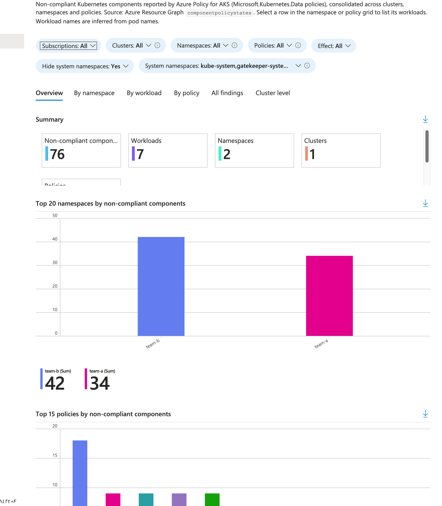

# AKS Policy Compliance Toolkit

Tools for reviewing Azure Policy for Azure Kubernetes Service (AKS) and reporting non-compliant workloads across a whole estate, typically before moving policies from Audit to Deny.

In the Azure portal, Kubernetes policy compliance is viewed one policy at a time, then per cluster, then per component. This toolkit consolidates it into one view by **namespace, workload, policy and cluster**.



## What's included

| Component | What it does | Changes anything? |
|---|---|---|
| **Current-state queries** (`queries/01–03`) | Inventory policy assignments, effects and overrides; show which policies fail per cluster | No |
| **In-cluster counts** (`queries/04-constraint-violations.sh` / `.ps1`) | Complete Gatekeeper violation counts from a cluster, above the Azure Policy 500-record cap | No |
| **Workbook** (`reporting/workbook`) | Azure Monitor workbook: overview, by namespace, by workload, by policy, all findings and cluster level, with filters, drill-down and Excel export | Creates one workbook resource |
| **Reporting queries** (`reporting/queries/05–09`) | The workbook views as Resource Graph queries | No |
| **CSV export** (`reporting/export`) | Every non-compliant workload to CSV: whole estate plus one file per namespace. Bash and PowerShell versions. | No |
| **Custom policy** (`custom-policies/netpol-no-allow-all`) | Flags NetworkPolicy rules that allow traffic from or to any peer, with tests | Only if you create and assign it |

## Documentation

- **How to run the toolkit:** step-by-step instructions, prerequisites and troubleshooting:
  - **[Bash](docs/how-to-run.md):** Azure Cloud Shell (Bash), Linux, macOS or WSL, using the Azure CLI.
  - **[PowerShell](docs/how-to-run-powershell.md):** PowerShell 7 on Windows, macOS or Linux, or Cloud Shell (PowerShell), using the Az modules.
- **[Reference guide](docs/reference.md):** what each file does, how the reporting works, output formats, example queries and custom policy parameters.

## Quick start

**Bash** in [Azure Cloud Shell](https://shell.azure.com), with Reader on the subscriptions containing your AKS clusters:

```bash
git clone https://github.com/sam-cogan/aks-policy-compliance-toolkit.git
cd aks-policy-compliance-toolkit
chmod +x queries/*.sh reporting/export/*.sh

# Export every non-compliant workload to CSV (add a management group ID as the second argument to scope it)
./reporting/export/export-noncompliance.sh ./results/noncompliance

# Deploy the workbook
az deployment group create -g <resource-group> -f reporting/workbook/main.bicep
```

**PowerShell 7** (Windows, or Cloud Shell PowerShell), with the Az modules:

```powershell
git clone https://github.com/sam-cogan/aks-policy-compliance-toolkit.git
Set-Location aks-policy-compliance-toolkit
Connect-AzAccount   # not needed in Cloud Shell

./reporting/export/Export-NonCompliance.ps1 -OutputPath ./results/noncompliance   # add -ManagementGroup <id> to scope it
New-AzResourceGroupDeployment -ResourceGroupName <resource-group> -TemplateFile ./reporting/workbook/main.json
```

See the [bash](docs/how-to-run.md) or [PowerShell](docs/how-to-run-powershell.md) guide for the full procedure.

## Requirements

- **Bash:** Azure CLI with the `resource-graph` extension, and `jq`. **PowerShell:** PowerShell 7 with Az.Accounts, Az.ResourceGraph, Az.Resources and Az.Aks. Cloud Shell includes both.
- Reader on the AKS subscriptions or a management group above them
- The Azure Policy add-on enabled on the clusters, with Kubernetes policies assigned
- For the in-cluster counts: `kubectl` access to the cluster

## Licence

MIT. See [LICENSE](LICENSE). Provided as-is, with no warranty. This is not an official Microsoft product or support offering. Test in a non-production environment first.
